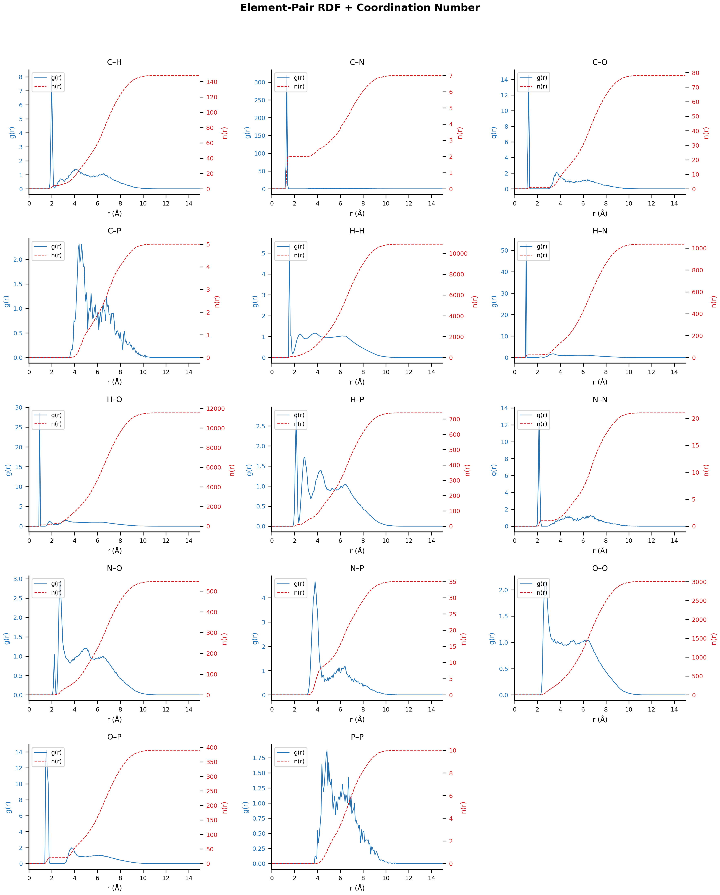
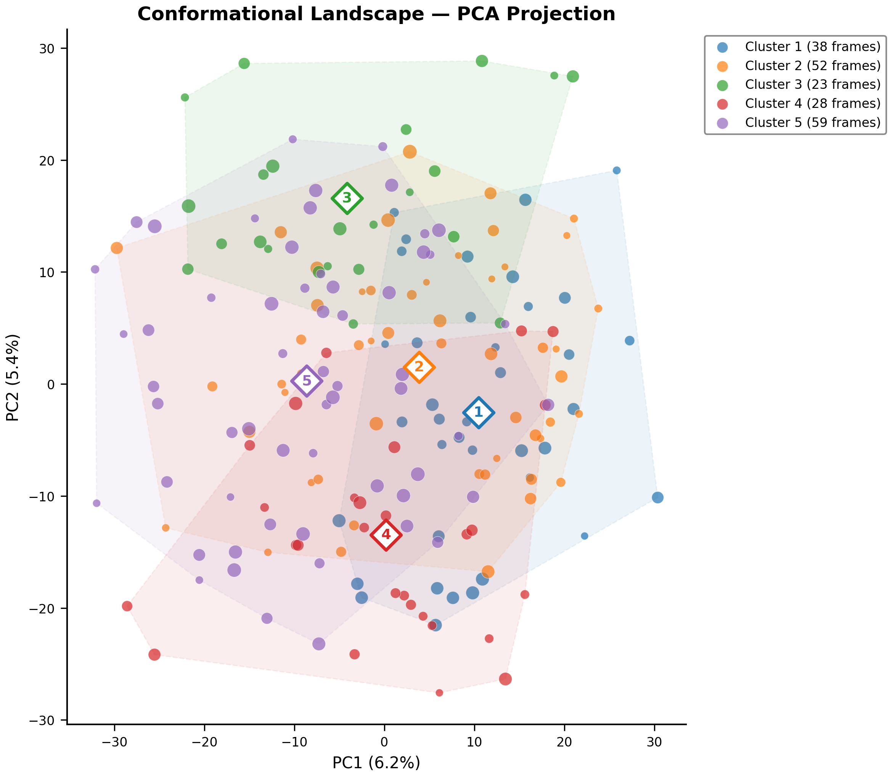

<p align="center">
  
</p>

<h3 align="center"><em>Molecular Dynamics Automation Agent — Post-Processing &amp; Publication-Ready Figures</em></h3>

<p align="center">
  <strong>Version 0.0.1</strong> &nbsp;|&nbsp;
  Desmond MD &bull; GROMACS (planned) &bull; LAMMPS (planned)
</p>

---

## What is MOTUS?

**MOTUS** is a unified, automated post-processing pipeline for molecular dynamics (MD) simulations. Starting with **Schrödinger Desmond**, it runs a comprehensive suite of **14 analyses** and generates **publication-quality figures** — vector PDFs for journals and high-resolution PNGs for preview — all from a single command.

The long-term vision: a **fully automated MD agent** that handles analysis and figure generation across Desmond, GROMACS, and LAMMPS with a consistent interface.

<p align="center">
  
</p>

---

## Quick Start

```bash
# Full analysis + figures (14 analyses, one command)
./desmond-analysis.sh desmond_md_job_my-system --plot

# Figures only (re-plot from existing data)
./desmond-analysis.sh desmond_md_job_my-system --fig-only

# Specific plot type
./desmond-analysis.sh desmond_md_job_my-system --plot --plot-type cluster
```

**Requirements:**
- Linux with Schrödinger Suite (tested with 2025-2)
- Python 3.8+ with `numpy`, `matplotlib`, `scipy`
- GPU recommended for trajectory analysis speed

---

## Analysis Pipeline

One command triggers up to **14 automated analyses**:

| # | Analysis | Output | Protein | Small Molecule |
|---|----------|--------|:-------:|:--------------:|
| 1 | Simulation Summary | `analysis_report.txt` | ✓ | ✓ |
| 2 | Energy Timeseries & Stats | `energy_timeseries.csv` | ✓ | ✓ |
| 3 | Hydrogen Bond Analysis | `hbonds_*.csv` | ✓ | ✓ |
| 4 | Solute-Water Shell Classification | `solute_water_shells.csv` | ✓ | ✓ |
| 5 | RMSD / RMSF (EAF pipeline) | `full_analysis-*.csv` | ✓ | — |
| 6 | SIMA (Simulation Interactions Diagram) | `L_Torsions.dat`, `L-Properties.dat` | ✓ | ✓ |
| 7 | Radial Distribution Functions (g(r) + n(r)) | `rdf_*.csv` | ✓ | ✓ |
| 8 | Density Cross-Sections (1D + 2D) | `density_*.csv` | ✓ | ✓ |
| 9 | Radius of Gyration (Rg) | `rg_*.csv` | ✓ | ✓ |
| 10 | Distance Monitoring | `distance_*.csv` | ✓ | ✓ |
| 11 | Water Residence Time | `water_residence_*.csv` | ✓ | ✓ |
| 12 | Conformational Clustering + PCA | `cluster_*.csv`, `cluster_pca.csv` | ✓ | ✓ |
| 13 | Molecular Dipole Moment | `dipole_*.csv` | ✓ | ✓ |
| 14 | Free Volume / Void Analysis | `free_volume.csv` | ✓ | ✓ |

**Smart detection:** automatically distinguishes protein systems from small-molecule systems; skips protein-only analyses for non-protein simulations without errors.

---

## Publication-Quality Figures

MOTUS generates **publication-ready vector figures** styled after leading journals (Nature, JACS, JCTC). All figures output as both PDF (vector) and PNG (300 DPI).

### Summary Dashboard

Multi-panel overview: **energy, temperature, pressure, and volume** traces in one figure — perfect for supplementary information.

<p align="center">
  
</p>

### Energy Analysis

Time-series traces and histograms with KDE for total, potential, and kinetic energy.

<p align="center">
  
</p>

### Water Shell Analysis

Three-layer water classification: **bound** (&lt;3.5 Å), **2nd shell** (3.5–5.0 Å), and **free** (&gt;5.0 Å). Stacked area chart + pie chart.

<p align="center">
  
</p>

### Radial Distribution Functions — g(r) + Coordination Number

Dual Y-axis plots: **g(r)** (blue solid, left axis) and **coordination number n(r)** (red dashed, right axis).

**Element-Pair RDF** — every element × every other element:

<p align="center">
  
</p>

**Water Shell RDF** — bound water, free water vs solute, and water-water:

<p align="center">
  
</p>

### Simulation Interactions Diagram (SIMA)

Fully automated SIMA — **no Maestro GUI needed**. Generates `.dat` files directly from trajectory.

**Ligand Torsion Radar Plots** — time-colored radial plots:

<p align="center">
  
</p>

**Ligand Properties** — RMSD, SASA, PSA, MolSA, and intramolecular H-bonds:

<p align="center">
  
</p>

**Torsion Heatmaps** — 2D conformational landscape:

<p align="center">
  
</p>

### Conformational Clustering — PCA Scatter (ML-Style)

Hierarchical RMSD clustering + PCA projection. **Convex hulls**, cluster centroids, and time-evolution coloring — the kind of scatter plot you see in ML papers.

<p align="center">
  
</p>

---

## Figure Output

All figures saved in `<md_job>/analysis/figures/`:

| Format | Resolution | Purpose |
|--------|-----------|---------|
| **`.pdf`** | Vector | Journal submission, LaTeX inclusion |
| **`.png`** | 300 DPI | Quick preview, presentations, GitHub |

**Styling:**
- Arial / DejaVu Sans font family (publication standard)
- No top or right spines (clean, modern look)
- Tight bounding boxes for direct LaTeX inclusion
- Dual Y-axis with color coding for complex plots
- Convex hulls + centroids for clustering visualization

---

## Repository Structure

```
motus/
├── README.md                      ← You are here
├── LICENSE                        ← MIT
├── .gitignore
├── docs/images/                   ← Screenshots for documentation
│   ├── MOTUS-top.png              ← Banner
│   ├── MOTUS-middle.png           ← Overview diagram
│   └── ...                        ← Figure examples
├── desmond-md.sh                  ← Automated MD job submission & monitoring
├── desmond-analysis.sh            ← Post-processing pipeline (orchestrator)
├── desmond_plot.py                ← Publication-quality figure generator
│
├── rdf_gen.py                     ← RDF + coordination number
├── sima_gen.py / sima_plot.py     ← SIMA data + figure generators
├── density_gen.py                 ← 1D/2D density cross-sections
├── rg_gen.py                      ← Radius of gyration
├── dist_gen.py                    ← Distance monitoring
├── water_res_gen.py               ← Water residence time
├── cluster_gen.py                 ← Conformational clustering + PCA
├── dipole_gen.py                  ← Molecular dipole moment
└── freevol_gen.py                 ← Free volume / void analysis
```

---

## Components

### `desmond-md.sh` — MD Job Runner

Submits and monitors Desmond MD simulations from a setup folder.

```
Usage:
  desmond-md.sh <desmond_setup_XXXXX> [OPTIONS]

Options:
  -t  <ps>     Simulation time (default: 2000 ps)
  -i  <ps>     Recording interval (default: 1 ps)
  -T  <K>      Temperature (default: 300 K)
  -P  <bar>    Pressure (default: 1.01325 bar)
  -g  <ids>    GPU device IDs (default: 0)
  -w            Wait for job completion
  --dry-run     Generate .msj without submitting
```

### `desmond-analysis.sh` — Post-Processing Orchestrator

The main driver. 14 analyses, one command.

```
Usage:
  desmond-analysis.sh <desmond_md_job_XXXXX> [OPTIONS]

Options:
  --plot              Run full analysis + generate figures (PDF + PNG)
  --fig-only          Re-plot from existing CSV data (skip computation)
  --plot-type <type>  Select plots: energy|hbonds|water_shells|rdf|density|rg|
                      distance|water_res|dipole|freevol|cluster|dashboard|all
  --asl1 <asl>        Override primary atom selection
  --asl2 <asl>        Override secondary atom selection
```

### `desmond_plot.py` — Figure Generator

Reads CSV files and generates 14+ plot types:
- `energy` — Time series + distribution histograms
- `hbonds` — H-bond counts over time
- `water_shells` — Three-layer water classification
- `rdf` — g(r) + n(r) dual Y-axis
- `density` — 1D profiles + 2D heatmaps
- `rg` — Radius of gyration time series
- `distance` — Key atomic distance monitoring
- `water_res` — Survival probability curves
- `dipole` — Total + per-molecule dipole moments
- `freevol` — Free volume / FFV analysis
- `cluster` — RMSD matrix heatmap + populations + **PCA scatter**
- `dashboard` — Multi-panel summary

### Analysis Modules

Each `*_gen.py` is a self-contained, GPU-accelerated analysis that reads `.cms` + trajectory and writes CSV output. All are independently runnable.

---

## Roadmap

| Milestone | Status |
|-----------|--------|
| Desmond post-processing (14 analyses) | ✅ v0.0.1 |
| PCA clustering scatter plots | ✅ v0.0.1 |
| GROMACS analysis modules | 🚧 Planned |
| LAMMPS analysis modules | 🚧 Planned |
| Electrostatic Potential (ESP) | 🚧 Planned |
| Binding site volume | 🚧 Planned |
| Secondary structure (DSSP) | 🚧 Planned |
| Unified CLI interface (MOTUS CLI) | 🚧 Planned |
| AI-driven analysis & interpretation | 🚧 Planned |

---

## License

MIT — see [LICENSE](LICENSE) file.

---

## Citation

If you use MOTUS in your research, please cite:

```
MOTUS: Molecular Dynamics Automation Agent. Version 0.0.1.
https://github.com/xhy/motus
```

---

<p align="center">
  <sub>Built for computational chemists who value their time.</sub>
</p>
