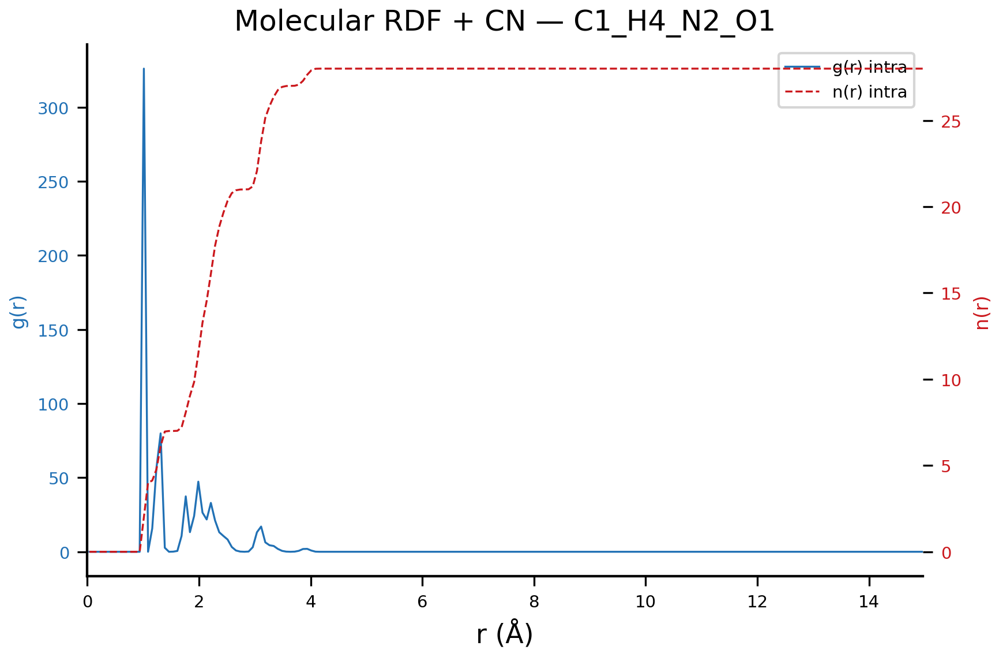

<p align="center">
  
</p>

<h3 align="center"><em>Molecular Dynamics Automation Agent — Post-Processing &amp; Publication-Ready Figures</em></h3>

<p align="center">
  <strong>Version 0.0.1</strong> &nbsp;|&nbsp;
  Desmond MD &bull; GROMACS (planned) &bull; LAMMPS (planned)
</p>

---

## What is MOTUS?

**MOTUS** is a unified, automated post-processing pipeline for molecular dynamics (MD) simulations. Starting with **Schrödinger Desmond**, it runs a comprehensive suite of analyses and generates **publication-quality figures** — vector PDFs for journals and high-resolution PNGs for preview — all from a single command.

The long-term vision: a **fully automated MD agent** that handles analysis and figure generation across Desmond, GROMACS, and LAMMPS with a consistent interface.

---

## Quick Start

```bash
# Full analysis + figures
./desmond-analysis.sh desmond_md_job_my-system --plot

# Figures only (re-plot from existing data)
./desmond-analysis.sh desmond_md_job_my-system --fig-only

# Specific plot type
./desmond-analysis.sh desmond_md_job_my-system --plot --plot-type rdf
```

**Requirements:**
- Linux with Schrödinger Suite (tested with 2025-2)
- Python 3.8+ with `numpy`, `matplotlib`
- GPU recommended for trajectory analysis speed

---

## Analysis Pipeline

One command triggers up to **7 automated analyses**:

| # | Analysis | Output | Protein | Small Molecule |
|---|----------|--------|:-------:|:--------------:|
| 1 | Simulation Summary | `analysis_report.txt` | ✓ | ✓ |
| 2 | Energy Timeseries & Stats | `energy_timeseries.csv` | ✓ | ✓ |
| 3 | Hydrogen Bond Analysis | `hbonds_*.csv` | ✓ | ✓ |
| 4 | Solute-Water Shell Classification | `solute_water_shells.csv` | ✓ | ✓ |
| 5 | RMSD / RMSF (EAF pipeline) | `full_analysis-*.csv` | ✓ | — |
| 6 | SIMA (Simulation Interactions Diagram) | `L_Torsions.dat`, `L-Properties.dat` | ✓ | ✓ |
| 7 | Radial Distribution Functions (g(r) + n(r)) | `rdf_*.csv` | ✓ | ✓ |
| 8 | Publication Figures | `figures/*.pdf`, `figures/*.png` | ✓ | ✓ |

**Smart detection:** automatically distinguishes protein systems from small-molecule systems; skips protein-only analyses for non-protein simulations without errors.

---

## Publication-Quality Figures

MOTUS generates **publication-ready vector figures** styled after leading journals (Nature, JACS, JCTC).

### Summary Dashboard

The overview dashboard combines **energy, temperature, pressure, and volume** traces into a single figure — perfect for supplementary information.

<p align="center">
  
</p>

### Energy Analysis

Time-series traces (left) and histograms with KDE (right) for total, potential, and kinetic energy.

<p align="center">
  
</p>

### Water Shell Analysis

Three-layer water classification: **bound** (&lt;3.5 Å), **2nd shell** (3.5–5.0 Å), and **free** (&gt;5.0 Å). Stacked area chart (left) + pie chart (right) show the solvation environment over time.

<p align="center">
  
</p>

### Radial Distribution Functions — g(r) + Coordination Number

Dual Y-axis plots: **g(r)** (blue solid, left axis) and **coordination number n(r)** (red dashed, right axis). Three levels of RDF:

**Element-Pair RDF** — every element × every other element:

<p align="center">
  
</p>

**Water Shell RDF** — bound water, free water vs solute, and water-water:

<p align="center">
  
</p>

**Molecular RDF** — intra-molecular vs inter-molecular:

<p align="center">
  
</p>

### Simulation Interactions Diagram (SIMA)

Fully automated SIMA — no Maestro GUI needed. Generates `.dat` files directly from trajectory data and produces:

**Ligand Torsion Radar Plots** — time-colored radial plots showing conformational sampling:

<p align="center">
  
</p>

**Ligand Properties** — RMSD, SASA, PSA, MolSA, and intramolecular H-bonds over time:

<p align="center">
  
</p>

**Torsion Heatmaps** — 2D conformational landscape for each rotatable bond:

<p align="center">
  
</p>

---

## Figure Output

All figures are saved in `<md_job>/analysis/figures/`:

| Format | Resolution | Purpose |
|--------|-----------|---------|
| **`.pdf`** | Vector | Journal submission, LaTeX inclusion |
| **`.png`** | 300 DPI | Quick preview, presentations, GitHub |

**Styling:**
- Arial / DejaVu Sans font family (publication standard)
- No top or right spines (clean, modern look)
- Tight bounding boxes for direct LaTeX inclusion
- Dual Y-axis with color coding for complex plots

---

## Repository Structure

```
motus/
├── README.md                      ← You are here
├── .gitignore
├── docs/images/                   ← Screenshots for documentation
│   ├── summary_dashboard.png
│   ├── rdf_elements.png
│   ├── sima_radial_L_Torsions_1.png
│   └── ...
├── desmond-analysis.sh            ← Main entry point (orchestrator)
├── desmond_plot.py                ← Publication-quality figure generator
├── rdf_gen.py                     ← Radial distribution function (g(r) + n(r))
├── sima_gen.py                    ← SIMA .dat generator (no GUI required)
└── sima_plot.py                   ← SIMA figure generator
```

---

## Components

### `desmond-analysis.sh` — Orchestrator

The main driver. Detects system type, runs all applicable analyses, generates a text report, and optionally produces publication figures.

```
Usage:
  desmond-analysis.sh <desmond_md_job_XXXXX> [OPTIONS]

Options:
  --plot              Run full analysis + generate figures (PDF + PNG)
  --fig-only          Re-plot from existing CSV data (skip computation)
  --plot-type <type>  Select plots: energy|hbonds|water_shells|rdf|dashboard|all
  --asl1 <asl>        Override primary atom selection (default: protein or solute)
  --asl2 <asl>        Override secondary atom selection (default: ligand or water)
```

### `desmond_plot.py` — Figure Generator

Reads CSV files and generates 6 plot types:
- `energy` — Time series + distribution histograms
- `hbonds` — H-bond counts over time
- `water_shells` — Three-layer water classification (stacked area + pie)
- `contacts` — Solute-water contact analysis
- `rdf` — RDF with dual Y-axis g(r) + n(r)
- `dashboard` — Multi-panel summary

### `rdf_gen.py` — RDF Calculator

Computes three levels of RDF directly from `.cms` + trajectory:
1. **Element-pair** — every element type pair (C–C, C–O, N–H, …)
2. **Molecular** — intra-molecular (same molecule) vs inter-molecular
3. **Water-shell** — bound water (&lt;3.5 Å) and free water (&gt;5.0 Å) vs solute

Output: `rdf_*.csv` with columns `r_A`, `g_r`, `n_r`

### `sima_gen.py` — SIMA Data Generator

Generates `L_Torsions.dat` and `L-Properties.dat` directly from trajectory data — no Maestro GUI required. Auto-detects the ligand (largest molecule) for non-protein systems.

### `sima_plot.py` — SIMA Figure Generator

Reads `.dat` files and produces:
- Radial plots (time-colored torsion angles)
- 2D heatmaps (conformational landscape)
- Time-series and distribution plots
- Properties overview (RMSD, SASA, PSA, MolSA, H-bonds)

---

## Roadmap

| Milestone | Status |
|-----------|--------|
| Desmond post-processing (7 analyses) | ✅ v0.0.1 |
| SVG output support | 🚧 Planned |
| GROMACS analysis modules | 🚧 Planned |
| LAMMPS analysis modules | 🚧 Planned |
| Unified CLI interface (MOTUS CLI) | 🚧 Planned |
| AI-driven analysis & interpretation | 🚧 Planned |

---

## License

MIT — see [LICENSE](LICENSE) file.

---

## Citation

If you use MOTUS in your research, please cite:

```
MOTUS: Molecular Dynamics Automation Agent. Version 0.0.1.
https://github.com/xhy/motus
```

---

<p align="center">
  <sub>Built for computational chemists who value their time. 🧪</sub>
</p>
